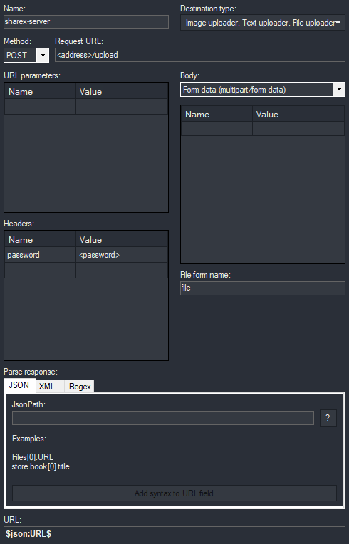

# ShareX Server

A simple [ShareX](https://sharex.github.io/) custom upload server allowing files to be uploaded and then accessed using the resulting web address.

The [Open Graph protocol](https://ogp.me/) has been used to allow for images and videos supported by HTML to be displayed as rich objects on platforms such as Discord and Twitter.

## Build the image

```bash
docker build -t sharex-server .
```

## Start the container

The [/data](data/) directory within the container is mounted to the host at `$(pwd)/data` and will hold any uploaded files, in addition to the [config.json](data/config.json) file and database used for link translation.

```bash
docker run -d -v $(pwd)/public/uploads:/usr/src/app/public/uploads \
-v $(pwd)/data:/usr/src/app/data \
--network app_net \
--ip 172.18.0.4 \
-e PASSWORD_HASH='<password_hash>' \
--name sharex-server sharex-server:latest
```

The `PASSWORD_HASH` variable must be created using bcrypt as can be done using the [bcrypt module](https://www.npmjs.com/package/bcrypt).

```bash
> const bcrypt = require('bcrypt');
> await bcrypt.hash("password", 8);
'$2b$08$ZF0zv8n7zhKiBOPOSXs1g.FhDXwf4GYxEZXHVGXq7yrfUruBrijmO'
```

## Running through a reverse proxy?

If you are running through a reverse proxy such as [NGINX](https://www.nginx.com/), you must include the `client_max_body_size` option the respective virtual-host file and reflect your `maxSize` value set within the [config.json](data/config.json) file.

Here's how this would be done within an NGINX virtual-host file:

```nginx
location /upload {
    ...
    client_max_body_size 500M;
}
```

## ShareX Configuration

ShareX must be configured to upload files to this server, this can be done by navigating to `Destinations > Custom Uploader Settings`.


